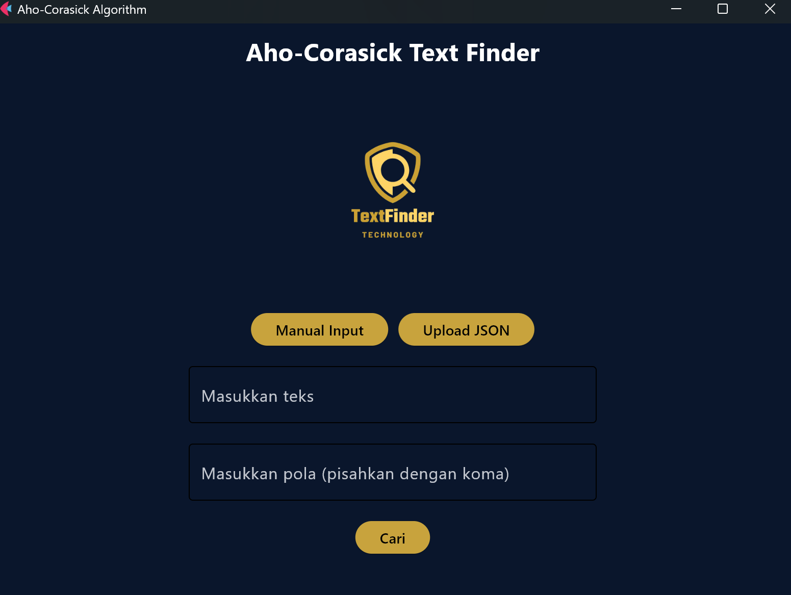
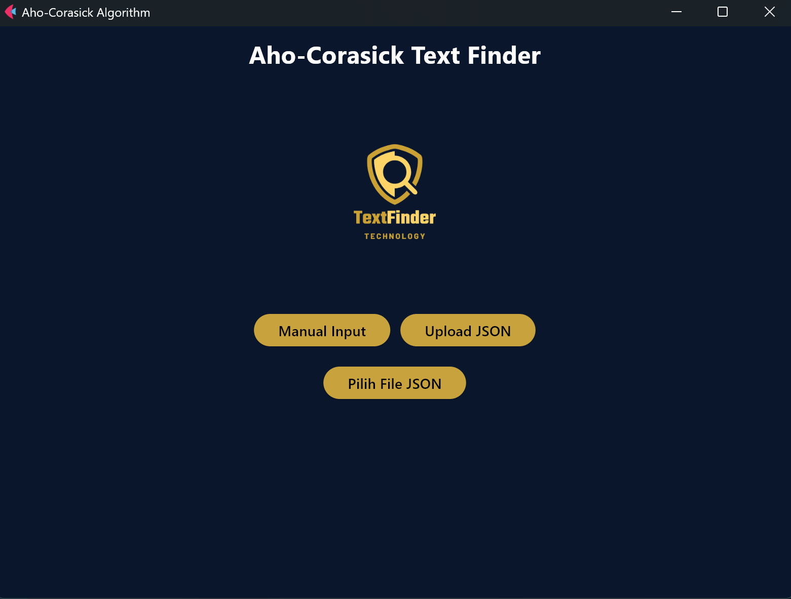
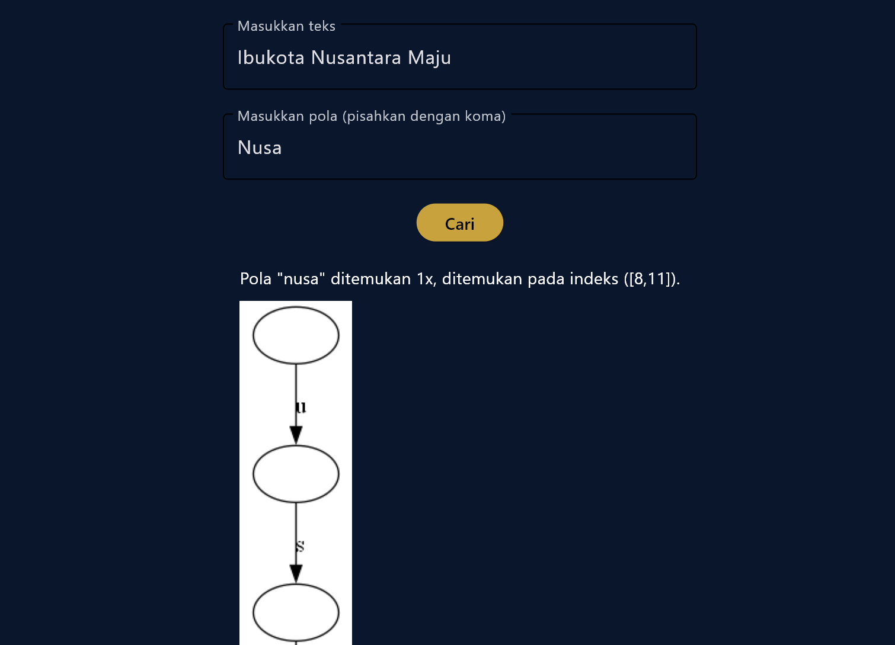
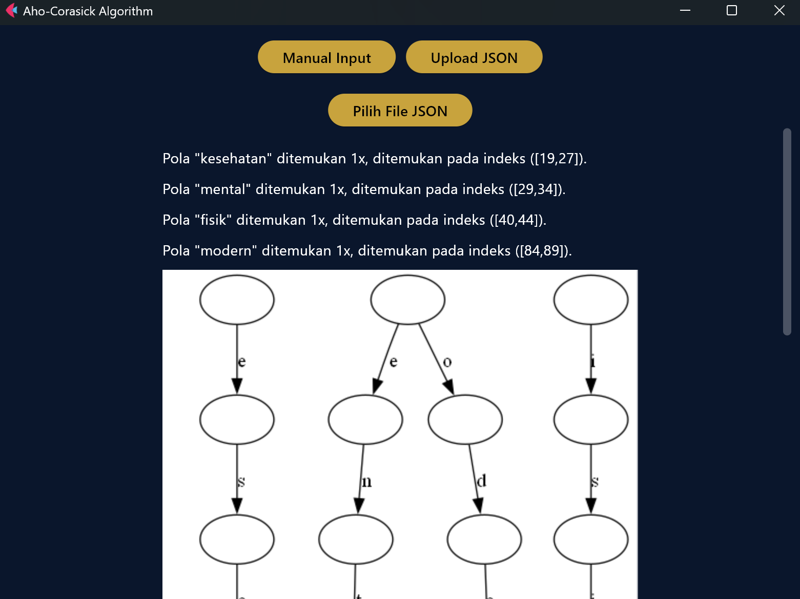

<div align="center">
  
</div>

# 🔍 Aho-Corasick Text Finder
Aho-Corasick algorithm to search a set of strings from a given text query
## 📝 Application Description
### Overview
This application leverages the Aho-Corasick algorithm to efficiently search for and match multiple string patterns within a given text. Ideal for handling large datasets, such as DNA sequences or malware code signatures, this tool builds a trie-based automaton offline. Once constructed, this automaton facilitates rapid, online text searches without the need for tedious index-by-index comparisons.

### Features
#### Core Functionality
- <b>Pattern Matching:</b> Quickly find multiple patterns within texts using a pre-built automaton.
- <b>Case-Insensitive Search:</b> Perform searches that ignore case differences.
- <b>Efficiency:</b> Reduce search times significantly compared to naive text searching algorithms.

#### Input/Output
- Input: Accepts JSON formatted input containing the text to be searched and an array of patterns.
- Output: Displays the count of each pattern found in the text and the indices of their occurrences.

#### GUI
The application features a user-friendly graphical interface that allows users to easily input their data and view results.

#### Bonus Features
- <b>Pattern Highlighting:</b> Visual indicators show where each pattern is found within the text.
- <b>Automaton Visualization:</b> Provides a graphical representation of the constructed automaton, offering insight into the algorithm's matching process.

## 💻 Tech Stacks
### Programming Language
- Python (version 3.11.9 or above)

### Dependencies
- flet (https://flet.dev/)
- graphviz (https://graphviz.org/)

## 🗂️ Program Structure
```bash
.
├── README.md
├── assets
│   ├── json_page.png
│   ├── json_result.png
│   ├── manual_page.png
│   ├── manual_result.png
│   └── textfinder-removebg-preview.png
├── img
├── src
│   └── aho.py
└── test
    ├── input1.json
    ├── input2.json
    ├── input3.json
    ├── input4.json
    ├── input5.json
    └── input6.json
```

## 🧙 Algorithms 
### Aho-Corasick
The Aho-Corasick algorithm is an efficient method for searching multiple patterns simultaneously within a text. It’s particularly useful when you need to find many patterns in a large text quickly.

### Key Steps
1. <b>Build the Automaton:</b> The algorithm starts by constructing an automaton based on a trie (prefix tree) of the patterns you want to search for. This trie is augmented with transition tables for fast matching and failure links that indicate fallback points when a direct match isn’t found.
2. <b>Add Failure Transitions:</b> In addition to normal transitions, failure transitions are added. These allow the search to continue efficiently by falling back to relevant nodes in the trie when a mismatch occurs, rather than restarting the search.
3. <b>Process the Text:</b> The algorithm then processes the input text sequentially. Using the constructed automaton, it efficiently matches patterns against the text. The failure transitions help avoid re-checking parts of the text unnecessarily.
4. <b>Identify Matches:</b> As patterns match, the algorithm records the matches and continues searching for other patterns using the automaton.

### Advantages
- <b>Time Efficiency:</b> The algorithm is very efficient with a time complexity of O(n + m + z), where n is the length of the text, m is the total length of the patterns, and z is the number of matches.
- <b>Multi-Pattern Matching:</b> It’s well-suited for cases where multiple patterns need to be matched simultaneously.

## 🛠️ Configuration Guide
1. Clone the repository to your local files. Access the repository [here](repository-link).
2. Make sure to install Python Programming Language. You can access the Python Programming Language Installer [here](https://www.python.org/downloads/). Make sure to add PATH during installation on your device.
3. Execute `pip install flet` and also `pip install graphviz` to set the application dependencies.
4. You also need to install the graphviz to your device. You can access the graphviz binary program [here](https://graphviz.org/download/). Make sure to add PATH during installation on your device.
5. Open the terminal and ensure that the directory is set to `AhoTextFinder`.
6. Execute `flet run "src/aho.py"` to command prompt / terminal.

## 🏃‍♂️ How To Run
1. Access The Aho-Corasick window page on your device.
2. You can choose the type of program input start from Manual Input" and "Upload JSON".
3. Once you click the type of program input that you desire, you can start by input text, pattern or upload the JSON file.

## 📸 Screenshots
<div align="center">
  
  <p><i>Manual Input Page</i></p>
</div>
<div align="center">
  
  <p><i>JSON Upload Page</i></p>
</div>
<div align="center">
  
  <p><i>Manual Input Result</i></p>
</div>
<div align="center">
  
  <p><i>JSON Upload Result</i></p>
</div>